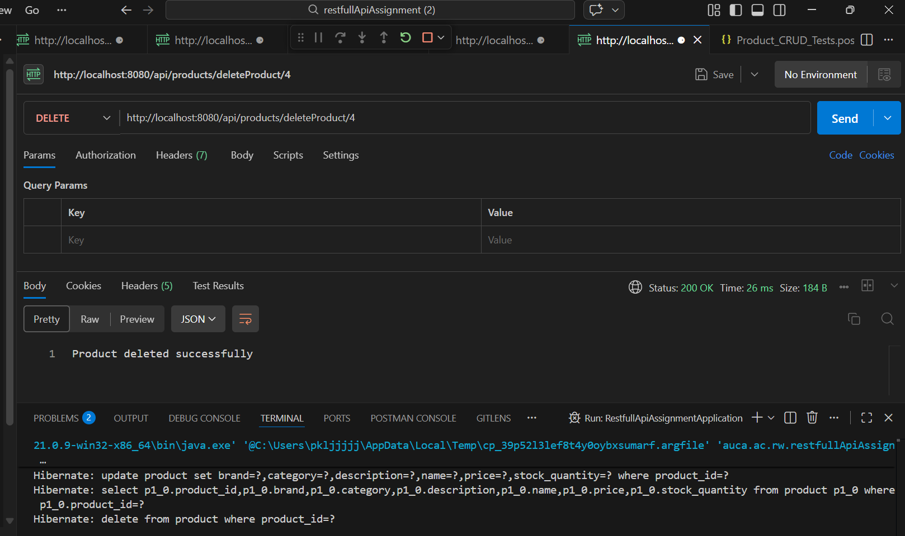

# Product CRUD API Assignment

**Student Name:** Utuje Vanessa  
**Student ID:** 27570  
**Date:** February 18, 2026

---

## Project Overview

This is a RESTful API assignment implementing Complete CRUD (Create, Read, Update, Delete) operations for a Product Management System using **Spring Boot** and **PostgreSQL**.

---

## API Endpoints

| Method | Endpoint | Description |
|--------|----------|-------------|
| **POST** | `/api/products/addProduct` | Create a new product |
| **GET** | `/api/products/getProduct/{id}` | Get product by ID |
| **GET** | `/api/products/allProducts` | Get all products |
| **PUT** | `/api/products/updateProduct/{id}` | Update product by ID |
| **DELETE** | `/api/products/deleteProduct/{id}` | Delete product by ID |
| **GET** | `/api/products/search?category=...` | Search by category |
| **GET** | `/api/products/searchByBrand?brand=...` | Search by brand |

---

## Testing Screenshots

### 1. POST Request - Create Product

*Creating a new product with ID 4 - Laptop Pro*

### 2. GET Request - Retrieve by ID

*Retrieving product details by product ID*

### 3. GET Request - Retrieve All Products

*Fetching all products from the database*

### 4. PUT Request - Update Product

*Updating product information - changing price, quantity, and description*

### 5. DELETE Request - Remove Product

*Deleting a product by ID*

---

## Database Configuration

- **Database:** PostgreSQL
- **Database Name:** `ecommerce_db`
- **Host:** localhost:5432
- **Username:** postgres
- **Password:** 123

---

## Technologies Used

- **Framework:** Spring Boot
- **Language:** Java
- **Database:** PostgreSQL
- **ORM:** Hibernate/JPA
- **Build Tool:** Maven
- **API Testing:** Postman

---

## Product Entity Fields

- `id` - Product ID (Primary Key)
- `name` - Product Name
- `description` - Product Description
- `price` - Product Price
- `category` - Product Category
- `stockQuantity` - Stock Quantity
- `brand` - Product Brand

---

## How to Run

1. **Start PostgreSQL** - Ensure PostgreSQL is running on port 5432
2. **Create Database** - Create `ecommerce_db` database
3. **Run Application** - Execute the Spring Boot application
4. **Test APIs** - Use Postman with the provided `Product_CRUD_Tests.postman_collection.json`

---

## Test Results Summary

✅ All CRUD operations tested successfully:
- POST: Product creation ✓
- GET: Product retrieval (single & all) ✓
- PUT: Product update ✓
- DELETE: Product deletion ✓
- Search: By category and brand ✓

---

**Assignment Status:** Complete
